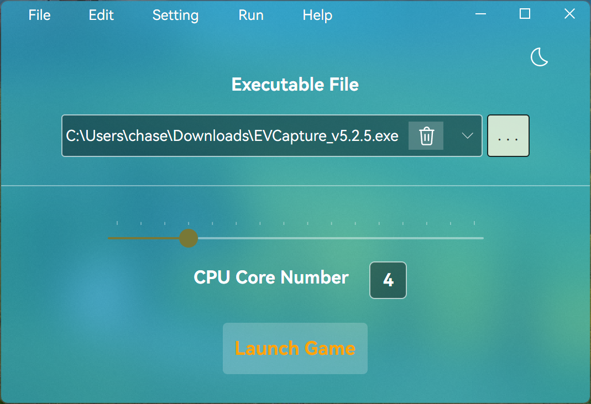
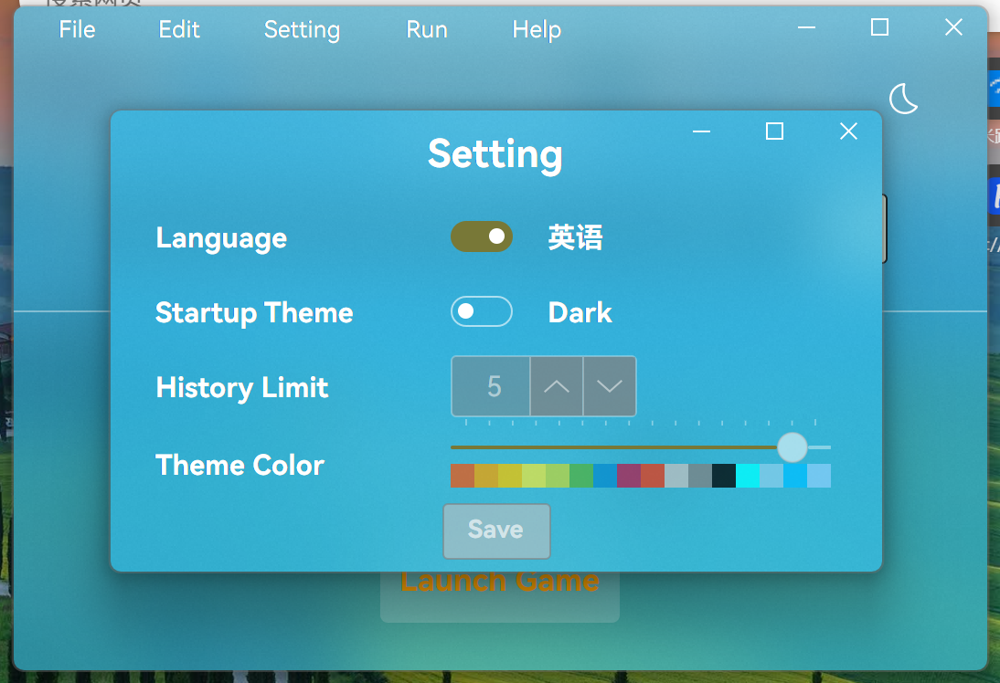

= AVACL
Firstname Lastname <author@asciidoctor.org>
3.0, July 29, 2022: AsciiDoc article template
:toc:
:icons: font
:url-quickref: https://docs.asciidoctor.org/asciidoc/latest/syntax-quick-reference/

image:https://img.shields.io/github/stars/hiddenblue/Avalonia.CpuLimiter?style=social?color=blue[GitHub stars]
image:https://img.shields.io/github/forks/hiddenblue/Avalonia.CpuLimiter?style=social?color=blue[GitHub forks]
image:https://img.shields.io/github/watchers/hiddenblue/Avalonia.CpuLimiter?style=social?color=blue[GitHub watchers]
image:https://img.shields.io/github/downloads/hiddenblue/Avalonia.CpuLimiter/total?color=green[GitHub Downloads (all assets, all releases)]
image:https://img.shields.io/github/repo-size/hiddenblue/Avalonia.CpuLimiter[GitHub repo size]
image:https://img.shields.io/github/last-commit/hiddenblue/Avalonia.CpuLimiter?color=purple[GitHub last commit]
image:https://img.shields.io/github/search/hiddenblue/Avalonia.CpuLimiter/query?color=green[GitHub search hit counter]

link:README.adoc[English] | link:README_cn.adoc[简体中文]

== 📖 About ==

AVACL (Avalonia.CpuLimiter) is a CPU control tool for programs developed using the https://github.com/AvaloniaUI/Avalonia[Avalonia] framework, supporting Windows and Linux platforms, enabling control over CPU core scheduling for numerous applications.

IMPORTANT: This tool requires administrator privileges on the corresponding platform to function properly; otherwise, it will not work normally.

== 🖼️ Interface ==

=== 🎨 Main Interface ===

=== ⚙️ Settings Interface ===

== 🚀 Usage Methods ==

=== 🪟 Windows Platform ===
Download the corresponding software package from Release, unzip it, and run avalonia.cpulimiter to open the main interface of the program.

Click the "Add File" button on the main interface to open the file explorer, select the game or application you want to run (usually in `exe` format), and click "OK."

Use the mouse wheel to click and drag the slider below to adjust the CPU core value.

Then click "Start Program," and the target program will be executed with the set CPU value.

NOTE: The CPU core value set here represents the number of "logical cores," not the conventional "physical cores." Logical cores = Physical cores x 2.

=== 🐧 Linux Platform ===
Currently, there is no simple method to launch the GUI with sudo permissions on Linux. Please use the command line to start.

Download the corresponding Linux platform package from Release and install it via the package manager. In the command line, execute:

.debian
[source, bash]
--
sudo apt install ./avalonia.cpulimiter_0.1-alpha_amd64_native_AOT.deb
--

Then, you can execute it through the command line using the sudo command:
[source, bash]
--
sudo -E /usr/bin/avalonia.cpulimiter.sh
--

WARNING: Programs launched via AVACL on Linux will also have root privileges. Please use with caution.

== 🛠️ Development & Debugging 🐛 ==

This project is developed using the cross-platform graphics framework https://github.com/AvaloniaUI/Avalonia[Avalonia], compiled with Dotnet 8.0 SDK, and supports features like Native AOT that significantly improve startup speed.

*Rider* and *Visual Studio* are the primary development tools.

*Log*

The program's logs are generated by default in the user's home directory. For debugging purposes, please check the logs.

== 💻 Supported Platforms ==

Native AOT: Fastest start, smallest binary size +
Ready to Run: Fast start, larger size +
Self-Contained: Large size, no need for dotnet runtime

[cols="1,2,1"]
.Table title
|===

| Platform | Features | Suffix

.3+| Windows (exe)
| Native AOT start
| native_aot

| Ready to Run
| R2R

| Self-Contained
| no_dotnet

.3+| Linux (.deb .rpm)
| Native AOT
| native_aot

| Ready to Run
| R2R

| Self-Contained
| no_dotnet

.3+| macOS
.3+|
.3+| unSupported

|===

NOTE: macOS is not supported primarily because I do not have a testing device. Some features of AVACL may be supported.

== ⏱️ ToDo ==

* [ ] Online automatic update feature, check and download updates
* [ ] Automatically select items and refresh historical usage time when clicking
* [ ] Optimize the logging system compatible with native AOT
* [ ] Add application icon functionality

== 📘 Reference Projects == 

. link:https://github.com/hiddenblue/prototype-game-runner[prototype-game-runner]
