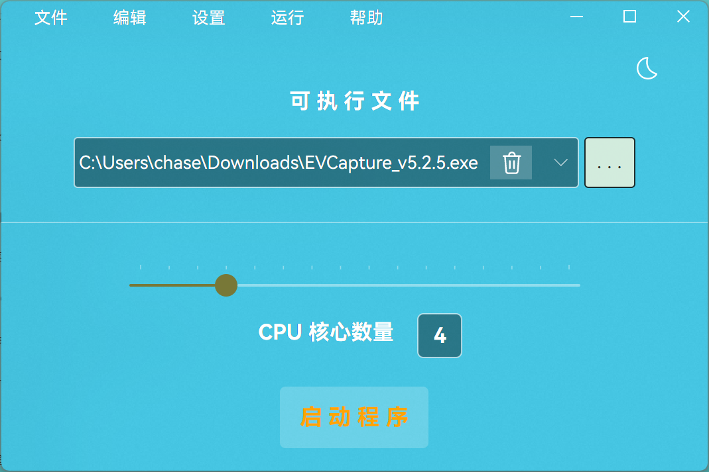
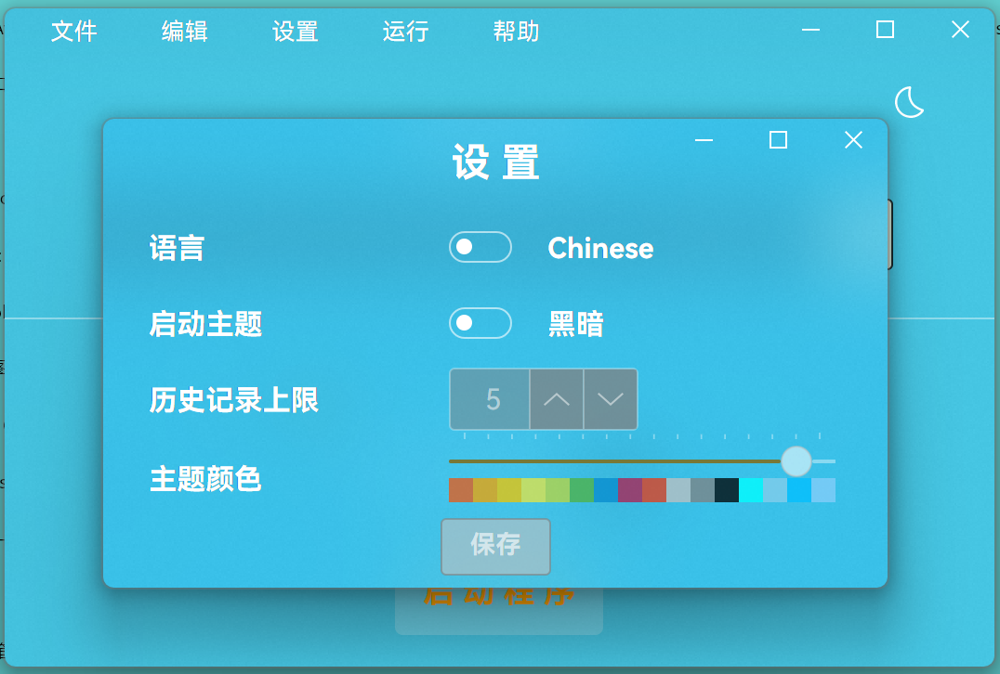

= AVACL
Firstname Lastname <author@asciidoctor.org>
3.0, July 29, 2022: AsciiDoc article template
:toc:
:icons: font
:url-quickref: https://docs.asciidoctor.org/asciidoc/latest/syntax-quick-reference/

image:https://img.shields.io/github/stars/hiddenblue/Avalonia.CpuLimiter?style=social?color=bule[GitHub stars]
image:https://img.shields.io/github/forks/hiddenblue/Avalonia.CpuLimiter?style=social?color=blue[GitHub forks]
image:https://img.shields.io/github/watchers/hiddenblue/Avalonia.CpuLimiter?style=social?color=blue[GitHub watchers]
image:https://img.shields.io/github/downloads/hiddenblue/Avalonia.CpuLimiter/total?color=green[GitHub Downloads (all assets, all releases)]image:https://img.shields.io/github/repo-size/hiddenblue/Avalonia.CpuLimiter[GitHub repo size]image:https://img.shields.io/github/last-commit/hiddenblue/Avalonia.CpuLimiter?color=puple[GitHub last commit]image:https://img.shields.io/github/search/hiddenblue/Avalonia.CpuLimiter/query?color=green[GitHub search hit counter]

link:README.adoc[English] | link:README_cn.adoc[简体中文]

== 📖About ==

AVACL (Avalonia.CpuLimiter) is a CPU control tool developed based on the https://github.com/AvaloniaUI/Avalonia[Avalonia] framework, supporting Windows and Linux platforms. It allows for the control of CPU core scheduling for various programs.

IMPORTANT: This tool requires administrator privileges on the corresponding platform to function properly.

== 🖼️Interface ==

=== Main Interface ===

=== Settings Interface ===

== 🚀Usage ==

=== Windows Platform ===
Download the corresponding software package from the Release section, extract it, and run `avalonia.cpulimiter` to open the main program interface.

Click the "Add File" button on the main interface to open the file explorer, select the game or application you want to control (usually in `exe` format), and click `OK`.

Return to the main interface, use the mouse to drag the slider at the bottom, or use the mouse wheel to adjust the CPU core number.

NOTE: The CPU core number set here is the number of `logical cores`, not the conventional number of `physical cores`.

After confirming, return to the main interface and click `Start Program` to execute the target program with the set CPU core number.

=== Linux Platform ===
Currently, there is no simple method to start programs requiring sudo privileges via the GUI on the Linux platform. Please use the command line to start.

Download the corresponding Linux platform package from the Release section and install it via the package manager.

.Debian
[source, bash]
--
sudo apt install ./avalonia.cpulimiter_0.1-alpha_amd64_native_AOT.deb
--

Then, you can use the sudo command to execute via the command line.
[source, bash]
--
sudo -E /usr/bin/avalonia.cpulimiter.sh
--

WARNING: Programs started via AVACL on Linux will also have root privileges. Please use them with caution.

== 🛠️Development & Debugging 🐛 ==

This project is developed based on the https://github.com/AvaloniaUI/Avalonia[Avalonia] cross-platform graphics framework, compiled using the Dotnet8.0 SDK, and supports features such as Native AOT to significantly improve startup speed.

*Rider* and *Visual Studio* are the primary development tools.

*Logs*

Program logs are generated by default in the user directory.

--

--