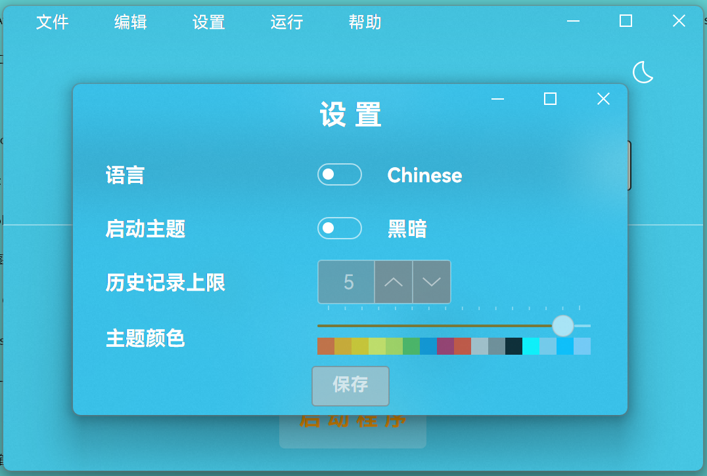

= AVACL
Firstname Lastname <author@asciidoctor.org>
3.0, July 29, 2022: AsciiDoc article template
:toc:
:icons: font
:url-quickref: https://docs.asciidoctor.org/asciidoc/latest/syntax-quick-reference/

image:https://img.shields.io/github/stars/hiddenblue/Avalonia.CpuLimiter?style=social?color=bule[GitHub stars]
image:https://img.shields.io/github/forks/hiddenblue/Avalonia.CpuLimiter?style=social?color=blue[GitHub forks]
image:https://img.shields.io/github/watchers/hiddenblue/Avalonia.CpuLimiter?style=social?color=blue[GitHub watchers]
image:https://img.shields.io/github/downloads/hiddenblue/Avalonia.CpuLimiter/total?color=green[GitHub Downloads (all assets, all releases)]image:https://img.shields.io/github/repo-size/hiddenblue/Avalonia.CpuLimiter[GitHub repo size]image:https://img.shields.io/github/last-commit/hiddenblue/Avalonia.CpuLimiter?color=puple[GitHub last commit]image:https://img.shields.io/github/search/hiddenblue/Avalonia.CpuLimiter/query?color=green[GitHub search hit counter]

link:README.adoc[English] | link:README_cn.adoc[简体中文]

== 📖关于 ==

AVACL(avalonia.cpulimiter)是一款基于 https://github.com/AvaloniaUI/Avalonia[Avalonia] 框架开发的程序CPU控制工具，支持Windows和Linux平台， 可以实现对众多程序CPU核心调度的控制。

IMPORTANT: 此工具需要对应平台管理员权限才能使用，否则无法正常工作

== 🖼️界面 ==

=== 主界面 ===
image::Misc/AVACL_cn_mainwin.png[主界面, 500, align="center"]

=== 设置界面 ===

== 🚀使用方法 ==

=== Windows平台 ===
下载Release当中对应的软件包，解压后运行avalonia.cpulimiter打开程序主界面

点击主界面的添加文件按钮，打开资源管理器，选择你想要打开的游戏或者应用程序(通常为 `exe` 格式)，点击 `确定`

回到主界面，用鼠标点击拖动下方的滑块，或者鼠标滚轮调整下方的CPU核心数值

NOTE: 此处设置的CPU核心数值为 `逻辑核心`数量，非常规的CPU`物理核心`数量

确定后，回到主界面，然后点击 `启动程序`，即可按照设定的CPU数值执行目标程序

=== Linux平台 ===
当前linux平台暂无通过GUI启动需要sudo权限的简单方法，请使用命令行启动

在Release下载所对应的linux平台的package，通过包管理器安装，
在命令行当中执行

.debian
[source, bash]
--
sudo apt install ./avalonia.cpulimiter_0.1-alpha_amd64_native_AOT.deb

--

然后可以通过命令行使用sudo命令执行
[source, bash]
--
sudo -E /usr/bin/avalonia.cpulimiter.sh
--

WARNING: 在Linux通过AVACL启动的程序也将具有root权限，请斟酌后使用

== 🛠️开发&Debug🐛 ==

此项目基于 https://github.com/AvaloniaUI/Avalonia[Avalonia] 跨平台图形框架开发，使用Dotnet8.0 SDK编译，支持Native AOT等大幅提高启动速度等特性。

*Rider* 和 *Visual studio* 是主要的开发工具。

*日志*

程序的日志默认在用户目录下生成

--

--
